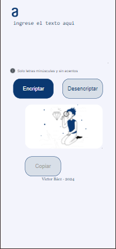

# Encriptador de Texto

Este proyecto es un encriptador de texto que permite encriptar y desencriptar mensajes utilizando un método simple de sustitución de caracteres. La interfaz es simple y fácil de usar, con funcionalidades adicionales que mejoran la experiencia del usuario.

## Características Principales

- **Cuadro de Texto Principal:** En la página principal, se encuentra un cuadro de texto donde se debe ingresar el mensaje que se desea encriptar o desencriptar.
  
- **Botones de Acción:** 
  - **Encriptar:** Convierte el texto ingresado en un mensaje encriptado según un algoritmo de sustitución.
  - **Desencriptar:** Convierte un mensaje encriptado de vuelta a su forma original.

- **Cuadro de Texto de Resultado:** Al lado del cuadro de texto principal, se encuentra un segundo cuadro de texto que muestra el mensaje encriptado o desencriptado.

- **Botón de Copiar:** 
  - Permite copiar el mensaje resultante al portapapeles.
  - Al copiar el mensaje, el cuadro de texto de resultado se limpia automáticamente.

## Funcionalidades Adicionales

- **Conversión Automática de Mayúsculas a Minúsculas:** Cualquier texto ingresado en mayúsculas se convierte automáticamente a minúsculas.

- **Conversión de Caracteres Especiales:**
  - Las vocales con tilde se convierten automáticamente a su versión sin tilde.
  - La letra "ñ" se maneja adecuadamente durante el proceso de encriptación y desencriptación.

## Ejemplo de Uso

1. **Ingresar Texto:** Escribe el mensaje que deseas encriptar o desencriptar en el cuadro de texto principal.
2. **Encriptar/Desencriptar:** Haz clic en el botón correspondiente para realizar la operación deseada.
3. **Copiar:** Una vez obtenido el resultado en el cuadro de texto de resultado, utiliza el botón "Copiar" para copiar el mensaje al portapapeles. El cuadro de texto de resultado se limpiará automáticamente después de copiar el contenido.

## Capturas de Pantalla

### Versión para Desktop

### Versión para Tablet

### Versión para Móvil

## Tecnologías Utilizadas

- **HTML**: Para la estructura de la página.
- **CSS**: Para los estilos y diseño responsivo.
- **JavaScript**: Para la lógica de encriptación y desencriptación, así como la gestión de la interfaz de usuario.
